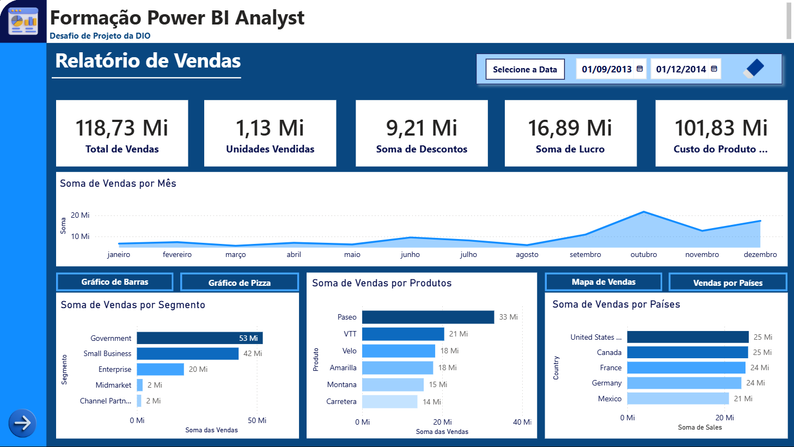
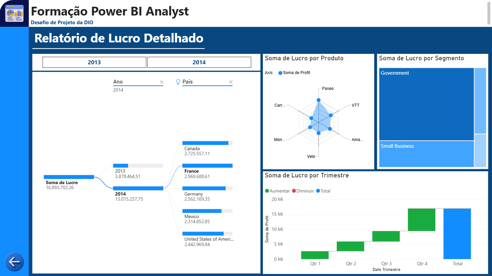

# Dashboard Financeiro no Power BI

Projeto desenvolvido como parte do desafio de projeto da [DIO](https://www.dio.me/), com o objetivo de criar um relatório financeiro elaborado no Power BI, explorando a criação de visuais avançados, botões de navegação, layout estruturado e indicadores (bookmarks).

## Sobre o desafio

O desafio consistia em elaborar um relatório com base no dataset de amostra "Financials" do Power BI. Os requisitos principais incluíam a criação de um layout com botões para navegação entre as páginas, segmentadores de dados e a aplicação de indicadores (bookmarks) para criar interatividade, permitindo a seleção e alternância de diferentes visuais sobre um mesmo assunto no mesmo espaço.

Repositório de referência com os dados originais: [julianazanelatto/power_bi_analyst](https://github.com/julianazanelatto/power_bi_analyst)

## Estrutura do relatório

O arquivo `.pbix` contém 2 páginas:

### 1. Relatório de Vendas

- Cartões de Total de Vendas, Unidades Vendidas, Descontos, Lucro e Custo
- Soma de Vendas por Mês (gráfico de linhas)
- Soma de Vendas por Segmento (alternância interativa entre gráfico de barras e gráfico de pizza)
- Soma de Vendas por Produtos
- Soma de Vendas por Países (alternância interativa entre mapa e gráfico de barras)
- Filtro por Período

### 2. Relatório de Lucro Detalhado

- Árvore de Decomposição (exploração interativa do lucro por ano e país)
- Soma de Lucro por Produto (visual de radar)
- Soma de Lucro por Segmento (treemap)
- Soma de Lucro por Trimestre (gráfico de cascata)
- Filtros por Ano e País

## Tecnologias utilizadas

- Power BI Desktop
- Visual Customizado (Radar Chart)

## Como visualizar

1. Baixe o arquivo `.pbix` deste repositório
2. Abra no Power BI Desktop
3. Navegue entre as páginas utilizando os botões com ícones de setas no menu lateral esquerdo
4. Para interagir com a alternância de gráficos (ex: Barras / Pizza), segure a tecla `Ctrl` e clique sobre o botão correspondente no relatório

## Relatório publicado

*Adicione aqui o link do relatório publicado no Power BI Service, após a publicação.*

## Créditos

Desafio proposto pela [DIO](https://www.dio.me/), com dados de amostra fornecidos por [Juliana Zanelatto](https://github.com/julianazanelatto).
